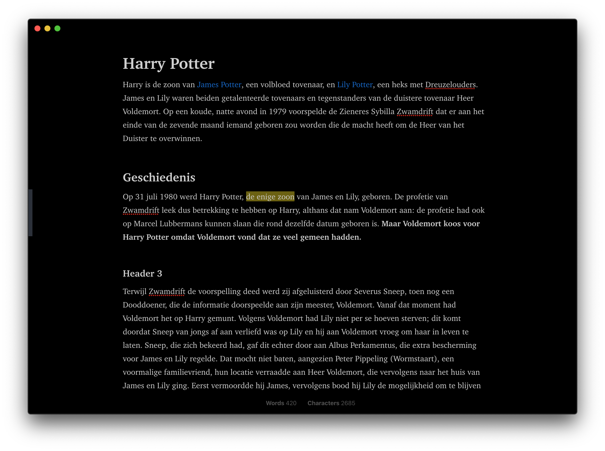
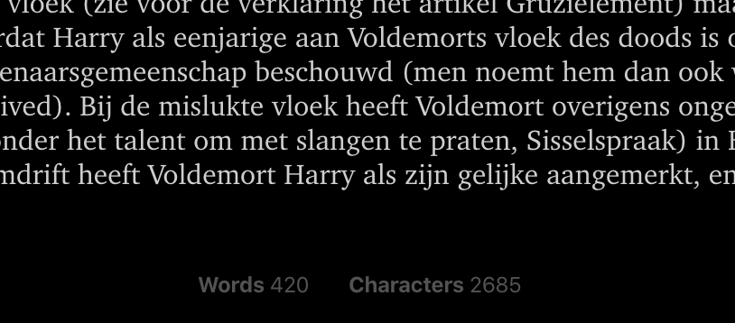

# Standard Notes Writer

Theme for distraction free writing in [Standard Notes](https://standardnotes.org/). 

- The theme hides most of the UI elements. The status bar and file pane are shown on hover.
- If you have Action Bar open, it will show the word- and character counts and hide all the rest.
- It uses a serif font

Note: I've created this for personal use with the Markdown Pro and [Rich Markdown](https://github.com/arturolinares/sn-rme) editors on macOS.

I can't guarantee it looks nice on any platform or editor. If you want some platform specific tweaks, shoot an issue.

## Installation

Open "Extensions" in Standard Notes and click "Import Extension". Enter the following URL as Extension Link and press Enter:

```
https://listed.to/p/OnTCvagxwd
```

## Preview



Word count:


